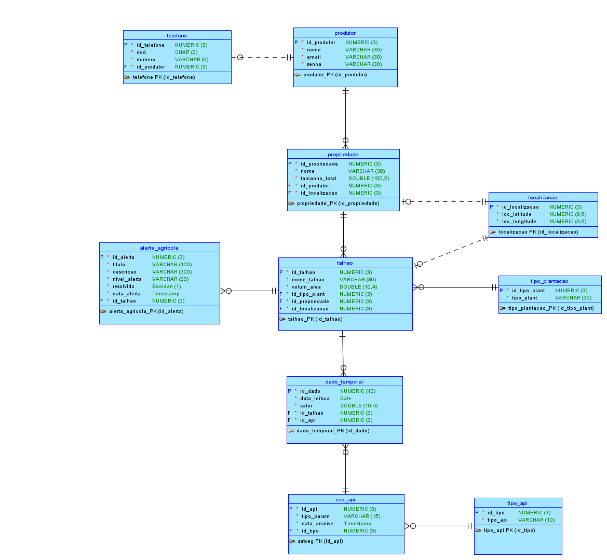

# Terra Nova — Gestão Agrícola Inteligente 🛰️🌱

> Plataforma de agricultura de precisão baseada em monitoramento via satélite e análise geoespacial de lavouras.

*Projeto desenvolvido para a entrega da **Global Solution 2026/1** da FIAP na disciplina de **Mobile Application Development**.*

---

## Repositório Github e Vídeo de Demonstração

[Repositório Github](https://github.com/Global-Solution-Space/Mobile-Application-Development) | [Vídeo Youtube]()

## Link Repositório GitHub Classroom

[Link Repositório]()

---

## 📱 Sobre a Solução (Global Solution)

O **Terra Nova** é uma solução de inteligência de dados voltada ao agronegócio sustentável. O aplicativo mobile se conecta a uma API Spring Boot desenvolvida em Java para permitir que produtores gerenciem suas **Propriedades** e cadastrem **Talhões** de cultivo, monitorando a saúde da lavoura por meio de dados de telemetria simulados de satélites orbitais (**SATveg** e **NASA Power**).

O sistema identifica automaticamente anomalias climáticas e biológicas, emitindo **Alertas Agrícolas** automáticos no dashboard para que o produtor possa agir rapidamente diante de estresses hídricos, baixa fertilidade ou risco de pragas.

### Conexão com os Objetivos de Desenvolvimento Sustentável (ODS da ONU)
- **ODS 2 (Fome Zero e Agricultura Sustentável):** Otimiza o rendimento de lavouras e reduz o desperdício de recursos agrícolas.
- **ODS 9 (Indústria, Inovação e Infraestrutura):** Aplica sensoriamento remoto de ponta e IoT na agricultura familiar.
- **ODS 11 (Cidades e Comunidades Sustentáveis):** Promove o fornecimento seguro e local de alimentos.
- **ODS 13 (Ação Contra a Mudança Global do Clima):** Fornece dados preventivos sobre estresse hídrico e oscilações severas de temperatura.

---

## 🗺️ Fluxo de Telas e Navegação

O aplicativo conta com **16 telas funcionais** integradas através de uma navegação tipada com `@react-navigation/native`, `@react-navigation/native-stack` e `@react-navigation/bottom-tabs`. O fluxo real do código parte do estado `isLoggedIn` no Zustand: usuários não autenticados ficam no fluxo de autenticação, enquanto usuários autenticados entram no painel principal.

```
MainStack (Navegação Stack Tipada)
├── Fluxo Auth (quando isLoggedIn = false)
│   ├── LoginScreen                  → Autenticação do Produtor integrada à API com validação Zod
│   └── RegisterScreen               → Cadastro do Produtor com telefone opcional
└── Fluxo App (quando isLoggedIn = true)
    ├── TabRoutes (Abas Inferiores)
    │   ├── Dashboard / HomeScreen    → KPIs, Propriedades, Alertas urgentes e eventos críticos
    │   ├── Talhões / TalhoesScreen   → Listagem, filtros e acesso ao CRUD de Talhões
    │   ├── Analise / AnaliseScreen   → Painéis SATveg e NASA Power com polling
    │   └── Perfil / PerfilScreen     → Dados do Produtor e atalhos de suporte
    ├── GerenciarTalhoesScreen        → Criação e edição de Talhões
    ├── PropriedadesScreen            → Visão de Propriedades cadastradas
    ├── GerenciarPropriedadesScreen   → Criação, edição e remoção de Propriedades
    ├── AlertasScreen                 → Central de Alertas Agrícolas
    ├── CriarAlertaScreen             → Criação e edição manual de Alertas
    ├── AnaliseDetalhesScreen         → Histórico detalhado e gráfico de telemetria
    ├── EditarPerfilScreen            → Atualização do Produtor e telefone
    ├── LogsScreen                    → Histórico local de atividades
    ├── FaqScreen                     → Perguntas frequentes do aplicativo
    └── SobreScreen                   → Informações institucionais e técnicas
```

---

## 🏗️ Arquitetura do Ecossistema Modelagem de Dados

O backend foi modelado em um banco relacional seguindo as regras de negócio de agricultura de precisão.



### Estrutura do Código Mobile

A base do aplicativo segue a separação estrita de responsabilidades com foco em código limpo, legível, modular e tipado em **TypeScript**:

```
Mobile-Application-Development/
├── App.tsx                         # Inicialização do app, tema escuro, NavigationContainer e sync global
├── index.js                        # Entrada registrada pelo Expo/React Native
├── app.json                        # Configuração Expo do aplicativo
├── package.json                    # Scripts e dependências do projeto
├── package-lock.json               # Lockfile das dependências npm
├── metro.config.js                 # Configuração Metro/Babel para React Native
├── babel.config.js                 # Preset Expo
├── tsconfig.json                   # Configuração TypeScript
├── AGENTS.md                       # Guia de contexto de domínio e padrões para IA
├── docs/
│   └── diagrama-banco.png          # Diagrama ERD usado na documentação
├── android/                        # Projeto nativo Android gerado pelo Expo prebuild/run:android
└── src/
    ├── components/
    │   ├── AlertCard/              # Card visual de AlertaAgricola
    │   ├── AnalisePanel/           # Painel reutilizável para SATveg e NASA Power
    │   ├── EmptyState/             # Estado vazio para listas
    │   ├── FormInput/              # Input padronizado com ícone e erro
    │   ├── Header/                 # Cabeçalho com safe area e botão de voltar
    │   ├── KpiCard/                # Cartões de indicadores do Dashboard
    │   ├── Modals/
    │   │   ├── ModalPropriedade.tsx
    │   │   └── ModalTipoPlantacao.tsx
    │   ├── PrimaryButton/          # Botão principal com loading
    │   ├── PropriedadeCard/        # Card de Propriedade
    │   ├── SelectChip/             # Chip de seleção
    │   ├── StatusBadge/            # Badge de status do Talhão
    │   ├── SuccessToast/           # Feedback visual de sucesso
    │   ├── TabSelector/            # Alternância de filtros/abas internas
    │   ├── TalhaoSelector/         # Seletor de Talhão para análises e alertas
    │   ├── TelemetriaHistoryCard/  # Card de histórico de dados temporais
    │   └── ValidationError/        # Exibição padronizada de erro de validação
    ├── constants/
    │   └── telemetria.ts           # Configurações SATveg/NDVI e NASA Power/precipitação
    ├── data/
    │   └── faq.ts                  # Conteúdo estático do FAQ
    ├── hooks/
    │   ├── useAppStateSync.ts      # Sincronização ao voltar do background
    │   ├── useFocusPolling.ts      # Polling apenas enquanto a tela está em foco
    │   └── useScreenSync.ts        # Reidratação silenciosa de dados globais
    ├── routes/
    │   ├── MainStack.tsx           # Stack tipada com fluxo Auth/App condicional
    │   └── TabRoutes.tsx           # Bottom Tabs: Dashboard, Talhões, Analise e Perfil
    ├── schemas/
    │   └── index.ts                # Schemas Zod de formulários e respostas da API
    ├── screens/
    │   ├── Alertas/
    │   │   ├── AlertasScreen.tsx
    │   │   └── CriarAlertaScreen.tsx
    │   ├── Analise/
    │   │   ├── AnaliseScreen.tsx
    │   │   └── AnaliseDetalhesScreen.tsx
    │   ├── Auth/
    │   │   ├── LoginScreen.tsx
    │   │   └── RegisterScreen.tsx
    │   ├── Faq/
    │   │   └── FaqScreen.tsx
    │   ├── Home/
    │   │   └── HomeScreen.tsx
    │   ├── Logs/
    │   │   └── LogsScreen.tsx
    │   ├── Perfil/
    │   │   ├── PerfilScreen.tsx
    │   │   └── EditarPerfilScreen.tsx
    │   ├── Propriedades/
    │   │   ├── PropriedadesScreen.tsx
    │   │   └── GerenciarPropriedadesScreen.tsx
    │   ├── Sobre/
    │   │   └── SobreScreen.tsx
    │   └── Talhoes/
    │       ├── TalhoesScreen.tsx
    │       └── GerenciarTalhoesScreen.tsx
    ├── services/
    │   └── api.ts                  # Axios, interceptor, endpoints e validação HATEOAS/Zod
    ├── store/
    │   └── useAppStore.ts          # Estado global, persistência AsyncStorage e ações assíncronas
    ├── theme/
    │   └── colors.ts               # Paleta dark high-tech do Terra Nova
    ├── types/
    │   └── index.ts                # Interfaces do domínio, HATEOAS e RootStackParamList
    └── utils/
        └── geolocation.ts          # Validação externa de coordenadas no Brasil
```

### 🔋 Estado Global & Persistência (Zustand + AsyncStorage)
Utilizamos a biblioteca **Zustand** para o controle de estados reativos na memória. Através do middleware `persist`, os dados vitais de sessão e cache do aplicativo são salvos de forma assíncrona no disco local do aparelho usando o `@react-native-async-storage/async-storage`: `currentUser`, `isLoggedIn`, logs de atividade, Propriedades, Talhões, Alertas, dados temporais e histórico de requisições de análise. Essa reidratação permite que o aplicativo abra com dados locais enquanto sincroniza novamente com a API Java.

### 🔄 Motor de Sincronização em Tempo Real (Custom Hooks)
- **`useAppStateSync.ts`:** Detecta quando o aplicativo sai do segundo plano (background) e volta a ficar ativo no celular (foreground), disparando chamadas de reidratação em conjunto para garantir que o produtor veja dados sempre atualizados.
- **`useFocusPolling.ts`:** Um motor genérico de **Polling Assíncrono com setTimeout**. Ele executa atualizações automáticas na rede a cada 10 segundos, mas **só enquanto o usuário estiver com a tela ativa**. Se o usuário mudar de aba ou sair do app, ele desliga o loop para economizar bateria e rede.
- **`useScreenSync.ts`:** Utiliza o `useFocusPolling` para manter dados globais (Talhões, Propriedades e Alertas) sincronizados em segundo plano em todas as telas principais.

---

### 🔄 Fluxo de Dados e Funcionamento da Arquitetura

O aplicativo utiliza um **Fluxo de Dados Unidirecional** acoplado ao gerenciamento de estado do **Zustand**. Esse padrão reduz significativamente o acoplamento das telas com a lógica de rede:

1. **Camada de Apresentação (View):** Componentes React Native (`screens` e `components`) renderizam o estado atual armazenado no Zustand. Quando o usuário executa uma ação (ex: cadastrar um talhão), a View dispara uma ação assíncrona da Store.
2. **Camada de Estado Global (Zustand Store):** O arquivo `useAppStore.ts` gerencia o estado na memória do aparelho. Ele ativa o indicador de carregamento (`isLoading: true`) e delega a chamada de rede para a camada de serviços.
3. **Camada de Rede (Axios Service):** O `api.ts` executa a requisição REST HTTP para o backend Java, aplicando tratamentos de cabeçalhos e decodificação do padrão HATEOAS.
4. **Atualização Reativa:** Ao receber a resposta positiva do servidor, a Store atualiza o array local na memória e desativa o carregamento (`isLoading: false`). Todos os componentes que consomem essa variável reagem e se atualizam sozinhos, eliminando a necessidade de atualizar estados locais tela por tela.

---

## 🛡️ Camada de Validação de Dados (Client-Side & Server-Side)

Para garantir consistência e evitar erros de banco de dados, implementamos uma **estratégia de validação em duas etapas**:

### 1. Validação Client-Side com Zod
Antes mesmo de realizar qualquer chamada HTTP, os formulários do aplicativo (como login e cadastro de Produtor, Propriedades e Talhões) utilizam schemas de validação estruturados com a biblioteca **Zod** (`src/schemas/`):
- **DDD e Telefone:** Validações de tamanho exato e caracteres numéricos.
- **Áreas e Medidas:** Conversão rigorosa de strings de input para números flutuantes positivos.
- **Campos Obrigatórios:** Bloqueio de submissão de campos vazios diretamente na interface com feedback visual instantâneo.

### 2. Tratamento Dinâmico de Validações do Backend (Spring Validation)
Quando regras de negócio complexas precisam ser checadas pelo servidor Java (ex: validação de e-mail único ou a regra de que a área dos talhões somados não pode ultrapassar o tamanho da propriedade):
- A API retorna um HTTP status `400 Bad Request` contendo o payload estruturado com o vetor `erros` (detalhando os campos e as mensagens de violação).
- O **Interceptor do Axios** em `src/services/api.ts` varre essa resposta em tempo de execução, formata os erros e exibe um alerta nativo consolidado no celular do usuário (ex: `locLatitude: A latitude deve ser no mínimo -90.0`), prevenindo erros silenciosos e facilitando a correção rápida dos dados.

---

## 🔌 Integração com API RESTful (Java Spring Boot)

A comunicação com o backend ocorre de forma 100% dinâmica através do cliente HTTP **Axios** (`src/services/api.ts`).

### Destaques da Integração:
1. **Padrão HATEOAS/Paginação:** O front-end desempacota respostas em formato `content`, `_embedded` ou array simples, mantendo suporte tipado a `_links` nos modelos do domínio.
2. **Validação de Contrato (Zod Runtime Validation):** As listas recebidas da API Java passam por esquemas de validação do Zod antes de entrar na store. Itens incompatíveis são filtrados para evitar que uma resposta parcial quebre a tela inteira.
3. **Interceptor Global de Erros:** Captura retornos HTTP do backend (400, 404, 500) de forma centralizada e exibe alertas visuais claros e amigáveis para o usuário.
4. **Criação Expressa em Cascata:** No cadastro de um Talhão, caso o Produtor não tenha uma Propriedade ou um Tipo de Plantação cadastrado, ele pode criá-los na hora por meio de Modais isolados, sem quebrar o fluxo do formulário.

---

## 🎨 Identidade Visual (Design System)

Toda a estilização do aplicativo é baseada em um **Dark Theme moderno e high-tech** utilizando cores cuidadosamente selecionadas e centralizadas no arquivo `src/theme/colors.ts`:

- **Cor de Destaque:** Emerald Green (`#10B981`) para refletir tecnologia voltada ao campo.
- **Background Primário:** Green-Slate (`#04100B`), criando uma experiência escura, elegante e confortável para leitura.
- **Tratamento de Status:** Vermelho (`#EF4444`) para perigos, Amarelo (`#F59E0B`) para alertas e Azul (`#3B82F6`) para informativos.

---

## 👥 Equipe de Desenvolvimento


<table>
<tr>
<th>Nome</th>
<th>RM</th>
<th>Turma</th>
<th>GitHub</th>
<th>LinkedIn</th>
</tr>

<tr>
<td>Enzo Okuizumi</td>
<td>561432</td>
<td>2TDSPG</td>
<td><a href="https://github.com/EnzoOkuizumiFiap">EnzoOkuizumiFiap</a></td>
<td><a href="https://www.linkedin.com/in/enzo-okuizumi-b60292256/">Enzo Okuizumi</a></td>
</tr>

<tr>
<td>Lucas Barros Gouveia</td>
<td>566422</td>
<td>2TDSPG</td>
<td><a href="https://github.com/LuzBGouveia">LuzBGouveia</a></td>
<td><a href="https://www.linkedin.com/in/lucas-barros-gouveia-09b147355/">Lucas Barros Gouveia</a></td>
</tr>

<tr>
<td>Milton Marcelino</td>
<td>564836</td>
<td>2TDSPG</td>
<td><a href="https://github.com/MiltonMarcelino">MiltonMarcelino</a></td>
<td><a href="http://linkedin.com/in/milton-marcelino-250298142">Milton Marcelino</a></td>
</tr>

<tr>
<td>Luna de Carvalho Guimarães</td>
<td>562290</td>
<td>2TDSPG</td>
<td><a href="https://github.com/lunaguima">lunaguima</a></td>
<td><a href="https://www.linkedin.com/in/luna-m-guimar%C3%A3es-1850ab173/">Luna M. Guimarães</a></td>
</tr>

<tr>
<td>Gustavo Okada</td>
<td>563428</td>
<td>2TDSPG</td>
<td><a href="https://github.com/Gdev3356">GustavoOkada7268</a></td>
<td><a href="https://www.linkedin.com/in/gustavo-okada-53a3b8359/">Gustavo Okada</a></td>
</tr>

</table>

---

## 🚀 Como Executar o Ecossistema

### 1. Pré-requisitos
- Node.js instalado (v18+)
- Expo Go instalado no celular físico (disponível no Google Play / App Store)
- JDK 17+ instalado (para rodar a API Java)

---

### 2. Iniciando a API Java (Backend)

O aplicativo Mobile se comunica com o backend Java Spring Boot. 

1. Acesse a pasta do backend:
   ```bash
   cd Java-Advanced
   ```
2. Inicie a aplicação via Maven (garanta que seu banco de dados Oracle ou H2 local esteja ativo):
   ```bash
   mvn spring-boot:run
   ```
3. A API estará rodando por padrão em `http://localhost:8080`.

---

### 3. Iniciando o Aplicativo React Native (Mobile)

Para que o celular físico consiga se conectar com o servidor da API rodando no seu computador:

1. Obtenha o seu **IP de rede local** (no Windows, execute `ipconfig` no prompt de comando. Exemplo: `192.168.1.7`).
2. Abra o arquivo `src/services/api.ts` e confira a constante `baseURL`. No código atual ela está configurada para `http://192.168.1.7:8080/api`; ajuste para o IP da sua máquina ou para `localhost` caso esteja usando emulador com acesso local adequado:
   ```typescript
   baseURL: 'http://SEU_IP_LOCAL:8080/api'
   ```
3. Abra um terminal na pasta root do projeto mobile:
   ```bash
   cd Mobile-Application-Development
   ```
4. Instale as dependências:
   ```bash
   npm install
   ```
5. Inicie o servidor do Expo conforme o script do projeto:
   ```bash
   npm run start
   ```
   Se quiser iniciar limpando o cache manualmente:
   ```bash
   npx expo start -c
   ```
6. Escaneie o QR Code exibido no terminal com a câmera do seu celular físico (iOS) ou com o aplicativo **Expo Go** (Android).
